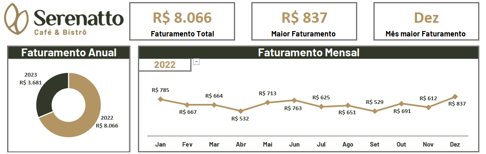
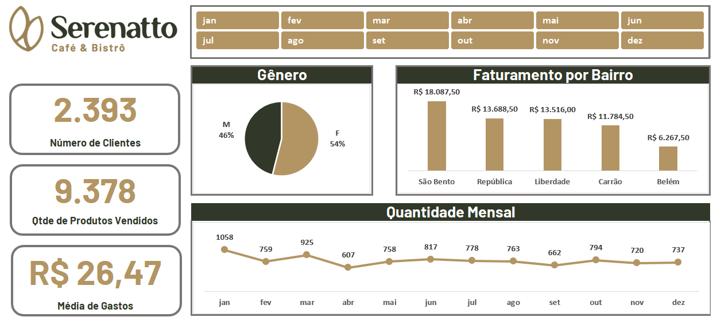
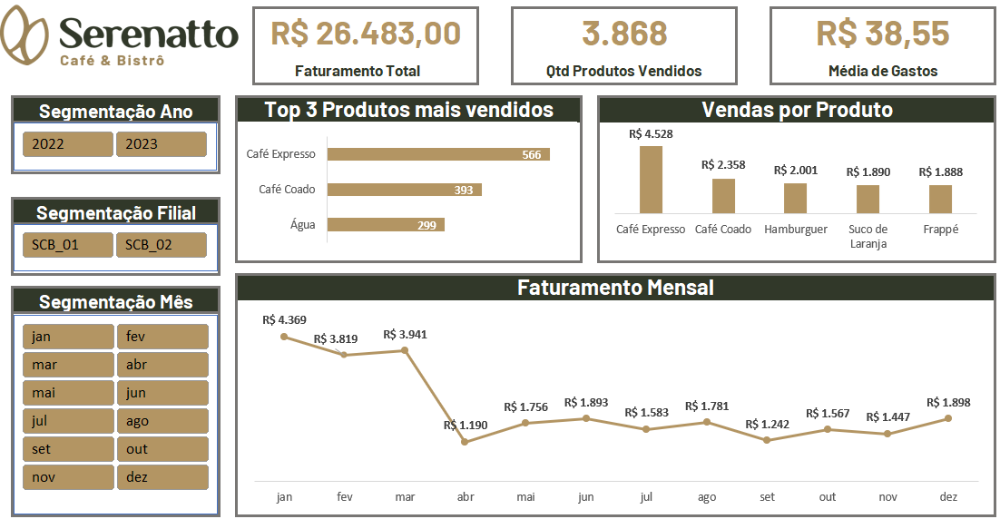

# Excel Business Dashboards

Coleção de dashboards desenvolvidos com **Microsoft Excel**, **Power Query** e **Power Pivot**, aplicando técnicas de preparação, modelagem e visualização de dados para apoiar análises de negócio.

## Sobre o projeto

Este repositório reúne três dashboards desenvolvidos com recursos nativos do Excel. O objetivo é transformar dados em informações claras e acessíveis, priorizando visualizações objetivas, navegação intuitiva e indicadores que apoiam a análise do desempenho do negócio.

## Tecnologias

- Microsoft Excel
- Power Query
- Power Pivot
- Tabelas Dinâmicas
- Gráficos Dinâmicos
- Segmentação de Dados

## Vendas

Visão executiva da evolução do faturamento ao longo do tempo.

  

**Indicadores**

- Faturamento total
- Maior faturamento do período
- Melhor mês
- Faturamento por ano
- Faturamento por mês
- Segmentação por ano

## Clientes

Visão do perfil dos clientes e da distribuição das vendas.

  

**Indicadores**

- Clientes
- Produtos vendidos
- Ticket médio
- Distribuição por gênero
- Faturamento por bairro
- Produtos vendidos por mês
- Segmentação por mês

## Filiais

Visão comparativa do desempenho comercial das unidades.

  

**Indicadores**

- Faturamento total
- Produtos vendidos
- Ticket médio
- Top 3 produtos mais vendidos
- Vendas por produto
- Faturamento por mês
- Segmentação por ano, filial e mês

## Objetivo

Demonstrar a aplicação de Excel, Power Query e Power Pivot na construção de dashboards interativos, desde a preparação e modelagem dos dados até a criação de indicadores para acompanhamento do desempenho do negócio.
